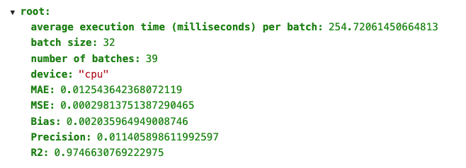
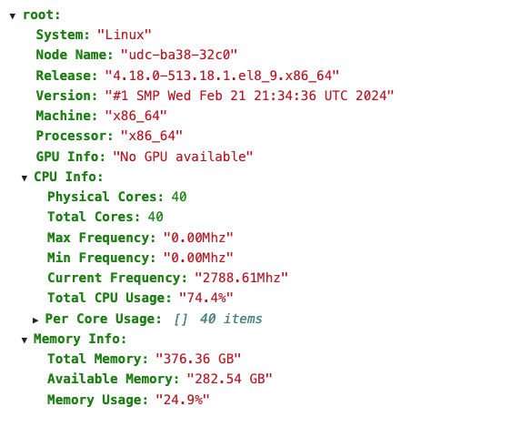

<h2 align="center">
  <strong>Big Data Systems - Fall 2024: Team 1</strong>
</h2>

<h3 align="center">
  <strong>Members</strong>
</h3>

<p align="center">
  <strong>George Shoriz</strong><br>
  <strong>Harold Haugen</strong><br>
  <strong>Dan Anthony</strong><br>
  <strong>Zack Lisman</strong>
</p>

---

## Table of Contents
- [Introduction](#introduction)
- [Problem Statement](#problem-statement)
- [Data Details](#data-details)
- [Experiment Process](#experiment-process)
- [Beyond the Original Specifications](#beyond-the-original-specifications)
- [Results](#results)
- [How to Set the Project Environment and Replicate Results](#how-to-set-the-project-environment-and-replicate-results)
  - [1. Using AWS SageMaker](#1-using-aws-sagemaker)
  - [2. Setting Up AWS S3](#2-setting-up-aws-s3)
  - [3. Configuring IAM Roles and Policies](#3-configuring-iam-roles-and-policies)
  - [4. Setting Up AWS Lambda Functions](#4-setting-up-aws-lambda-functions)
  - [5. Creating and Running AWS Step Functions](#5-creating-and-running-aws-step-functions)
  - [6. Monitoring with AWS CloudWatch](#6-monitoring-with-aws-cloudwatch)
- [Conclusion](#conclusion)

---

## Introduction

This project focuses on creating scalable and efficient data processing pipelines using the *AWS Step Function with Lambda*. Our objective is to investigate and implement critical data processing techniques such as cleaning, outlier removal, pre-processing, and model training while ensuring the system is optimized for both performance and cost-efficiency. By leveraging parallel Lambda executions and varying workload parameters (like `world_size`), the project sought to improve scalability and resource utilization.

We aim to get a better grasp of AWS capabilities and how to use them to optimize operations while keeping costs low and efficiency high. Our goal is to create a functional pipeline that will increase our ability to manage massive datasets, automate operations, and deploy machine learning models effectively.

---

## Problem Statement

The goal of this project is to design and implement a scalable data processing and machine learning pipeline using AWS tools to explore insights from an astronomical dataset. The project requires end-to-end processing of the dataset, starting with data pre-processing, cleaning, and outlier removal to ensure high-quality inputs for analysis. The cleaned dataset is then saved and processed through a program that performs inference using a machine learning model.

The problem we aim to address involves efficiently handling large-scale astronomical data while maintaining cost and time efficiency. This includes leveraging AWS services like SageMaker for development and execution, S3 for data storage, Step Functions for workflow orchestration, Lambda for scalable computing, and CloudWatch for monitoring and debugging.

By addressing this issue, the initiative hopes to achieve the following:

  - Automate and scale data pre-processing tasks using AWS services.
  - Efficiently train or fine-tune a machine learning model for redshift prediction from astronomical images and associated metadata.
  - Present results in a clear and insightful manner through tables and visualizations.
  - Identify and optimize resource utilization to ensure the solution is cost-effective and adaptable to real-world scenarios.

The significance of this project goes beyond its technological execution, since the insights gained from the data and the techniques utilized may be applied to other large-scale datasets in fields such as astronomy, healthcare, and others. This project offers a hands-on chance to investigate the challenges and rewards of developing strong, scalable pipelines for processing and analyzing complicated data.

---

## Data Details

The model that is used for redshift prediction is pre-trained as "a vision transformer encoder on Sloan Digital Sky Survey (SDSS) images to capture general patterns" and is then fine-tuned "with a specialized architecture for redshift prediction." This approach leverages the power of transfer learning, where the model first learns generalizable features from a vast collection of SDSS images and then adapts to the specific task of predicting redshift. This fine-tuning step enables the model to focus on intricate patterns and relationships within the dataset, such as the correlation between photometric magnitudes and redshift.

The SDSS dataset includes images with "corresponding magnitude values for the five photometric bands (u, g, r, i, z) and redshift targets." Each image is meticulously processed to ensure compatibility with the model's requirements, including cropping from 64 × 64 pixels to 32 × 32 pixels for input optimization. The magnitude values represent measurements of brightness across different wavelengths, which, combined with the image data, provide a rich and multi-dimensional view of celestial objects. This combination of image and numerical data ensures a comprehensive approach to redshift prediction, enhancing the model's ability to generalize across diverse astronomical objects.

The use of a vision transformer model is particularly significant for this task, as it excels in capturing spatial and contextual relationships in image data, making it well-suited for the analysis of celestial phenomena. By integrating both visual and numerical modalities, this methodology represents a cutting-edge approach in astrophysics, showcasing the potential of machine learning in advancing our understanding of the universe.
---

## Experiment Process

### Data Pre-Processing
The design process begins with a dataset like AI-for-Astronomy. The dataset will be cleaned, with missing values handled and outliers detected to assure quality. The cleaned data is then saved as a CSV file and transferred to an S3 bucket for further processing.

### Model Training
We next create a *Step Function* that calls an *AWS Lambda* function to execute data processing operations like data loading and machine learning model training. Once the model has completed its run, the results are recorded and shown in tables and visualizations for easy interpretation. Throughout the process, testing and validation are carried out to ensure the outputs' dependability and correctness.

### Evaluation Metrics
The descriptions of the primary metrics used during the evaluation of the prediction of redshift are reproduced below:
- **Mean Absolute Error (MAE)**: Measures the average magnitude of the errors between predicted and true values, providing insight into prediction accuracy.
- **Mean Square Error (MSE)**: Quantifies the average of squared errors, emphasizing larger deviations to highlight significant prediction errors.
- **Bias**: Measures the average residuals between predicted and true values, indicating any systematic over- or underestimation in predictions.
- **Precision**: Represents the expected scatter of errors, reflecting the consistency of the model's predictions.
- **R² Score**: Evaluates how well the model predicts compared to the mean of true values; a value closer to 1 indicates better predictive performance.

---

## Beyond the Original Specifications

We went beyond the project's initial scope by experimenting with different `world_size` parameters in *AWS Step Function with Lambda*. This allowed us to observe how changing the number of parallel processes affected both performance and cost efficiency.

Testing alternative `world_size` parameters helps determine the best configuration for our dataset, resulting in improved scalability and resource utilization. Additionally, we leveraged a *team group chat* for regular communication to coordinate our tasks, share insights, and manage project tasks.

---

## Results

| World Size | Lambda Init Duration (sec) | MapState Duration (sec) | Step Function Duration (sec) |
|------------|----------------------------|-------------------------|------------------------------|
| 2          | 0.373                      | 2.609                   | 3.161                        |
| 10         | 0.199                      | 3.203                   | 3.554                        |
| 24         | 0.476                      | 5.040                   | 5.682                        |

Experimenting with different `world_size` values in *AWS Step Functions with Lambda* revealed that increasing parallelism helps scalability but provides diminishing returns in performance beyond a certain point. Execution times varied, with lower `world_size` combinations being more cost-effective and time-efficient. Memory utilization was constant across workloads, allowing for better resource allocation.




---

## How to Set the Project Environment and Replicate Results

This section provides a detailed tutorial for setting up the project environment and replicating the results. Follow the steps below to ensure proper configuration and execution.

### 1. Using AWS SageMaker
1. Download the two files `Setup_Dependencies.ipynb` and `Update_IAM_Roles_And_Policies.ipynb` inside `How to Set the Project Environment and Replicate Results`
2. Run the `Setup_Dependencies.ipynb` notebook to install all necessary dependencies and configure the environment.
3. Use the `Update_IAM_Roles_And_Policies.ipynb` notebook to configure the necessary IAM roles and policies.

### 2. Setting Up AWS S3
1. Navigate to the S3 service in your AWS Management Console.
2. Create a new bucket that will host your Python scripts and store results.
3. Inside the bucket:
   - Create a folder named `scripts`.
   - Create another folder named `result`.

### 3. Download the Project Files
1. **Download the required files**:
   Navigate to the `How to Set the Project Environment and Replicate Results` folder in this repository and download the folders **'aws'**, **'code'**, and **'data'** this includes all scripts for preprocessing, inference, and configuration.
2. **Copy the Anomaly Detection folder**:
   Inside the downloaded files, locate the `Anomaly Detection` folder under `code` and upload it to the `scripts` folder in your S3 bucket.

### 4. Setting Up AWS Lambda Functions
1. Navigate to the AWS Lambda service in your AWS Management Console.
2. Create a Lambda function for executing the fmi_executor payloads.
3. Configure the Lambda function to process the scripts uploaded to the `scripts` folder in your S3 bucket.

### 5. Creating and Running AWS Step Functions
To facilitate serverless inference for the Astronomy AI model, this project uses an AWS Step Function. The Step Function orchestrates multiple AWS Lambda functions and processes a payload to execute tasks. Follow the steps below to set up and execute the state machine.

#### Overview of the Input Payload
The state machine accepts an input payload in the following format:

\```json
{
  "bucket": "cosmicai-data",
  "world_size": "2",
  "object_type": "folder",
  "S3_object_name": "scripts/Anomaly Detection",
  "data_path": "/tmp/scripts/Anomaly Detection/Inference/resized_inference.pt",
  "script": "/tmp/scripts/Anomaly Detection/Inference/inference.py"
}
\```

**Description of Payload Parameters:**
- `bucket`: Name of the S3 bucket containing the required Python scripts.
- `world_size`: Number of Lambda functions to invoke in parallel.
- `object_type`: Specifies the type of object being processed (e.g., folder or file).
- `S3_object_name`: Path to the script in the S3 bucket.
- `data_path`: Path to the data file used for inference.
- `script`: The inference script’s path within the Lambda environment.

#### File Organization for Step Functions
The folder structure for Step Functions and related files is as follows:

\```
aws/
├── lambda/
│   ├── initializer_FMI.py
│   ├── summarizer.py
│   ├── inference.py
│   ├── inference_FMI.py
│   └── initializer.py
├── split_data.py
├── stats.py
├── collect_lambda_logs.py
├── collect_logs.ipynb
├── compute_cost.py
├── demo input.json
├── plot_config.py
├── plots.ipynb
\```

**Lambda Folder Files:**
- `initializer_FMI.py` and `initializer.py`: Initialize the data distribution and tasks for Lambda functions.
- `summarizer.py`: Aggregates and combines results into a unified output.
- `inference.py` and `inference_FMI.py`: Handle the inference tasks, including model execution and data processing.

#### Setting Up the Step Function
1. Navigate to the AWS Step Functions service in the AWS Management Console.
2. Create a new state machine named `cosmicai`.
3. Upload and configure the Lambda functions (from the `lambda` folder) to the state machine.
4. Edit the input payload for the state machine as follows:

\```json
{
  "bucket": "<your-s3-bucket-name>",
  "world_size": "2",
  "object_type": "folder",
  "S3_object_name": "scripts/Anomaly Detection",
  "data_path": "/tmp/scripts/Anomaly Detection/Inference/resized_inference.pt",
  "script": "/tmp/scripts/Anomaly Detection/Inference/inference.py"
}
\```
5. Update the payload fields to match your S3 bucket and file paths.
6. Save the state machine configuration and ensure all necessary resources (Lambda, S3) are properly linked.

#### Executing the State Machine
1. Select the `cosmicai` state machine in the Step Functions console.
2. Click the Execute button to run the state machine with the configured input payload.
3. Monitor the execution to verify the results and troubleshoot if needed.

#### Viewing Execution Logs
Navigate to the AWS CloudWatch service in the AWS Management Console.
View execution logs under the log group:
- `/aws/lambda/cosmic-executor`

Use the provided script (`collect_lambda_logs.py`) to automate the retrieval of logs.

---

## Conclusion

Our findings showed that altering the `world_size` parameter has a considerable influence on both execution time and costs. For example, when we set the `world_size` to 2, the Step Function time was 3.1 seconds, but raising the `world_size` to 24 resulted in a duration of more than 5.6 seconds, even though more parallel processing was occurring. This shows that, after a certain point, increased parallelism creates overhead, resulting in inefficiencies rather than speed advantages.

These insights may be useful to anyone looking to optimize *AWS Step Functions with Lambda* for similar operations, as knowing this balance is critical for improving both performance and cost-efficiency.

To improve the program, we would investigate methods to decrease the cost of larger `world_size` setups, such as improving Lambda function coordination or dynamically allocating resources.

---